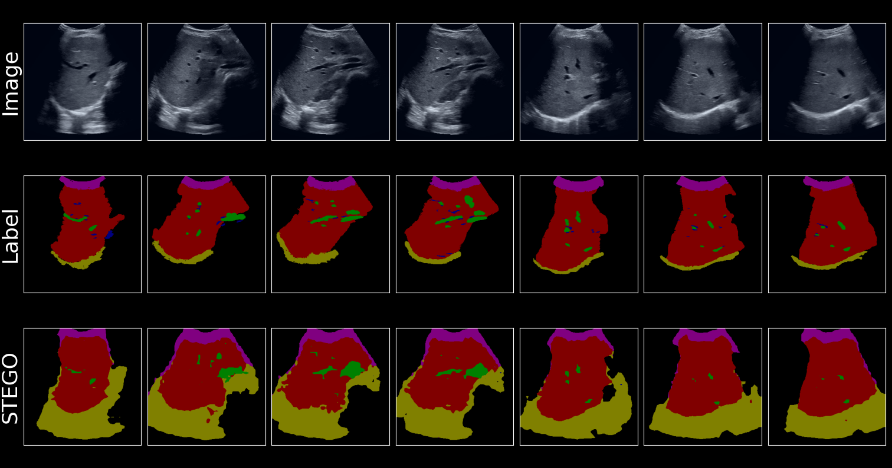

# Unsupervised semantic segmentation using STEGO on liver ultrasound

This is an implementation for unsupervised semantic segmentation task using STEGO model applied on liver ultrasound dataset.
The original implementation for STEGO model can be found [here](https://github.com/mhamilton723/STEGO/tree/master).

## Contents
- [Setup](#setup)
- [Training](#training)
- [Evaluation & Plotting](#evaluation-and-plotting)
- [Overview of STEGO](#overview-of-stego)
  - [Extracting feature correspondences](#extracting-feature-correspondences)
  - [Distilling feature correspondences](#distilling-feature-correspondences)
  - [The STEGO architecture](#the-stego-architecture)
- [Results](#results)

## Setup
### Clone this repository:
```
git clone https://github.com/tibetakinci/segment-liver  
cd src
```

### Setup conda environment:
Please visit the [Anaconda install page](https://docs.anaconda.com/anaconda/install/index.html) if you do not already have conda installed.
```
conda env create -f environment.yml  
conda activate stego
```

### Prepare dataset:
To train model don't forget to adjust variable **pytorch_data_dir** in [train_config.yml](src/configs/train_config.yml). The dataset directory should be in the following structure:    

```
dataset_name
|── imgs
|   ├── train
|   |   |── unique_img_name_1.jpg
|   |   └── unique_img_name_2.jpg
|   └── val
|       |── unique_img_name_3.jpg
|       └── unique_img_name_4.jpg
└── labels
    ├── train
    |   |── unique_img_name_1.png
    |   └── unique_img_name_2.png
    └── val
        |── unique_img_name_3.png
        └── unique_img_name_4.png 
```
> Note: [convert_dataset.py](src/convert_dataset.py) can be used to convert images between **.png** and **.jpg** by adjusting commented variables.  
> Note: Disregard **labels** directory from the structure if you do not have any labels, since it is only used for evaluation. 
> Note: Dataset should be downloaded from NAS. Please contact your supervisor to access dataset on NAS.

### Update train_config.yml:
- Adjust variables *pytorch_data_dir* and *dir_dataset_name* according to dataset directory and dataset name respectively. Keep *dataset_name* variable as 'directory'  
- Update *dir_dataset_n_classes* variable for desired clustering class number if needed.  
- Make sure that *crop_type* variable is set to **"five"**, **"random"** or **None** according to cropping used.
- Two model types can be used, **"vit_base"** or **"vit_small"** by adjusting *model_type* variable
- Hyperparameters used in loss function can be found under feature contrastive parameters. Tuning hyperparameters are challenging. Please refer to the Section A.11 from the [paper](https://arxiv.org/pdf/2203.08414.pdf).
- *n_images* variable under log parameters adjusts number of images to be plotted at inference time. 
- Variables such as *max_steps*, *max_epochs*, *lr*, *batch_size* can be setup accordingly.

### Download pretrained model:
By running below code, you can download the pretrained models to three different datasets; potsdam, cityscapes and cocostuff.
```
python download_models.py
```

## Training
### Crop dataset:
If necessary, the cropping tool can be employed to enhance the spatial resolution:
```
python crop_datasets.py
```
> Note: *crop_types* and *crop_ratios* variables can be modified based on the intended cropping design.

### Precompute kNNs:
Before training the model, generating kNN indices for the dataset is required:
```
python precompute_knns.py
```

### Train model:
Finally, you can start training by typing:
```
python train_segmentation.py
```

Hyperparameters can be adjusted in [train_config.yml](src/configs/train_config.yml).

To monitor training with tensorboard run the following from root directory:
```
tensorboard --logdir logs
```

## Evaluation and Plotting
### Evaluate pretrained model:
Configuration of evaluation is set in [eval_config.yml](src/configs/eval_config.yml) file. Please adjust variables such as *pytorch_data_dir*, *dir_dataset_name*, *dir_dataset_n_classes*, *model_paths*.
*model_paths* variable should be set to .ckpt file of your pretrained model.  
The images you would like to plot are specified in [eval_segmentation.py](src/eval_segmentation.py) file. List variable *all_good_images* contains indexes of images would like to be plotted.  
After setting up evaluation configuration and images to be plotted, you can run the code by typing:
```
python eval_segmentation.py
```
This code will open a .png file on your window which you can save and close.

### Plot DINO correspondence:
As DINO features are distilled in STEGO, plotting DINO features from your images are very useful. Configuration of plotting DINO correspondence is found at [plot_config.yml](src/configs/plot_config.yml). Make sure *dir_dataset_name* variable is correct and *dataset_name* is set to "directory".
*plot_correspondence* and *plot_movie* variables determine to output a .png image file or .mp4 video file.  
From [plot_dino_correspondence.py](src/plot_dino_correspondence.py) file, keep in mind the variables *colors*, *cmaps*, *img_num* and *query_points*:
- *colors* and *cmaps* variables indicate different colors to be used in plotting. Keep in mind the number of *query_points* should not be higher than number of *colors* to prevent confusion.  
- *img_num* is the index of image that would be used in plotting.
- *query_points* are tuples indicating coordinates in x and y axis.

After setting up variables, please run the above code:
```
python eval_segmentation.py
```

## Overview of STEGO
### Introduction
Semantic segmentation is the task of classifying each pixel in an image into specific labels. Earlier studies primarily emphasized supervised learning through the assignment of ground truth labels, while more recent research suggests the adoption of unsupervised learning to mitigate labor-intensive challenges.
Numerous techniques have been developed to acquire semantically significant features. However in contrast to previous methods, STEGO make use of pre-trained features and focuses on distilling knowledge. This decision is motivated by the observed correlations between unsupervised features being semantically consistent, both within the same image and across images.
Proposed STEGO(**S**elf-supervised **T**ransformer with **E**nergy-based **G**raph **O**ptimization) is a novel transformer-based architecture which has the ability of segmenting objects within an image without supervision by distilling pre-trained unsupervised visual features into clusters using novel contrastive loss.
STEGO basically aims to refine features of pre-trained backbone to yield semantic segmentation predictions when clustered. Embeddings of DINO model is being used because of their quality.

### Extracting feature correspondences
Self-supervised contrastive learning aims to train models to differentiate between similar and dissimilar data points without supervision. This is achieved by computing feature correspondence tensor whose entries represent the cosine similarity between image features. 
The below figure demonstrates the correspondence of three different data points in between same image and it's K-nearest-neighbor with respect to DINO as the feature extractor.


### Distilling feature correspondences
In order to compose a high quality semantic segmentation, STEGO distills pre-trained feature correspondences to learn a low-dimensional pixel-wise embedding. This is heavily inspired by CRF, which utilizes an undirected graphical model to refine noisy or low-resolution class predictions. 
In distillation process, visual backbone is kept frozen and training a segmentation head is focused. The novel contrastive loss function of the STEGO encourages distilled features to form compact clusters.
**S**patial **C**enter operation and 0-Clamping is introduced to the loss function because of such challenges as being unstable sometimes and balancing the learning signal for small objects.
Together with SC and 0-Clamp, the final correlation loss is defined as:  


### The STEGO architecture
First step of STEGO, frozen visual backbone is used as an input to segmentation head for predicting distilled features. Three distinct instantiations are utilized to train the segmentation head, self, KNN and random correspondences. 
STEGO's full loss is formulated as linear combination of weight(to control the balance of the learning signals) and contrastive loss function for each instantiation.  
Prediction pipeline of STEGO includes clustering and CRF as last two steps respectively. Due to feature distillation, STEGO's segmentation features form distinct clusters. Cosine-based minibatch K-Means employed to extract and assign classes from these clusters. Subsequently, the spatial resolution is enhanced through CRF refinement.


## Results
We evaluate STEGO on our dataset and observed the effect of using two backbones, ViT-Base and ViT-Small architectures of DINO.
The quantitative results demonstrate that STEGO can successfully segment upper and lower parts of liver. Challenging parts are segmenting vessels and white tissues around vessels. Most cases fail to segment white tissues while some cases are able to segment vessels.
